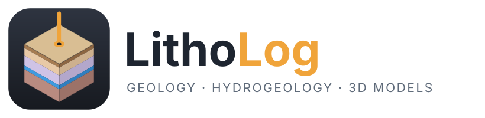
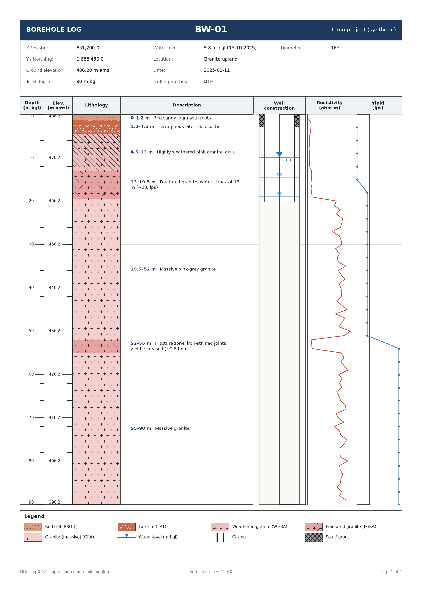
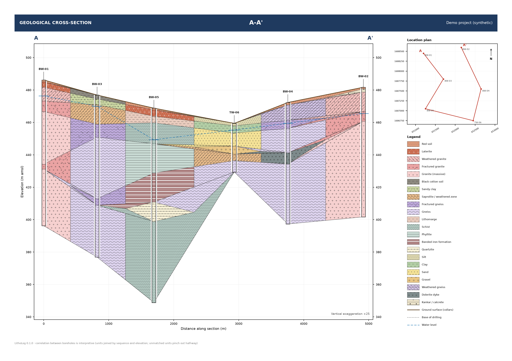
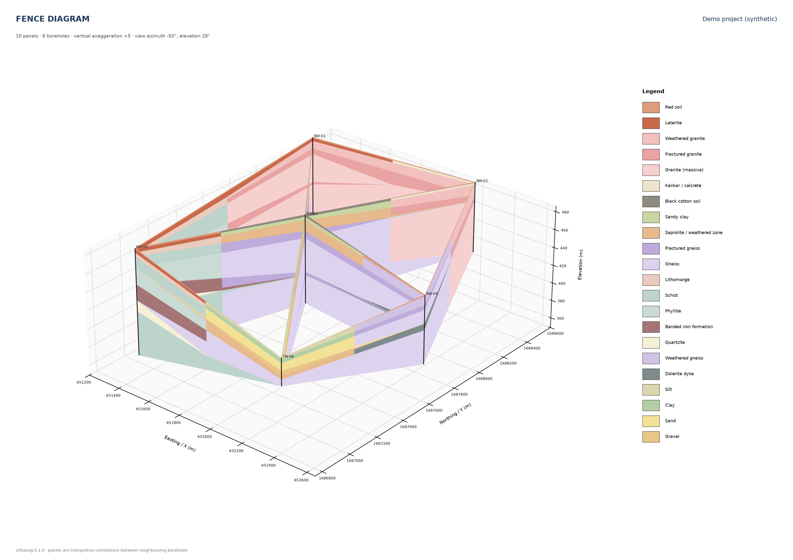
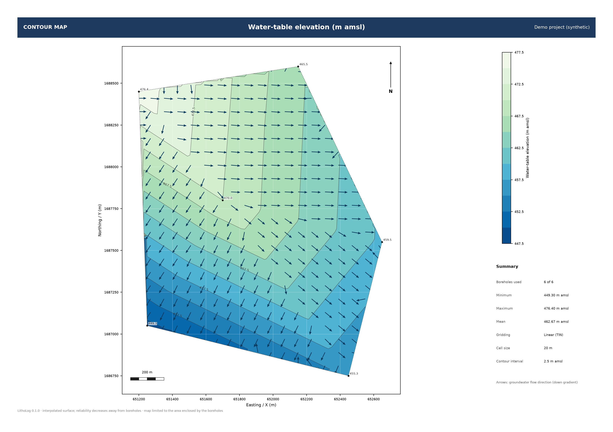
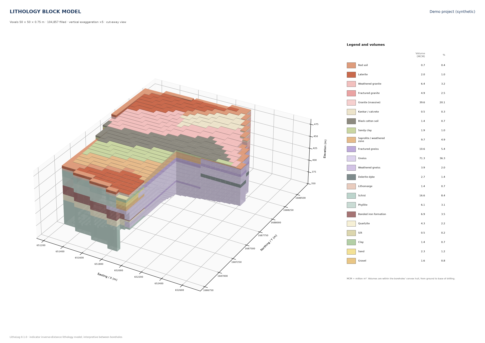
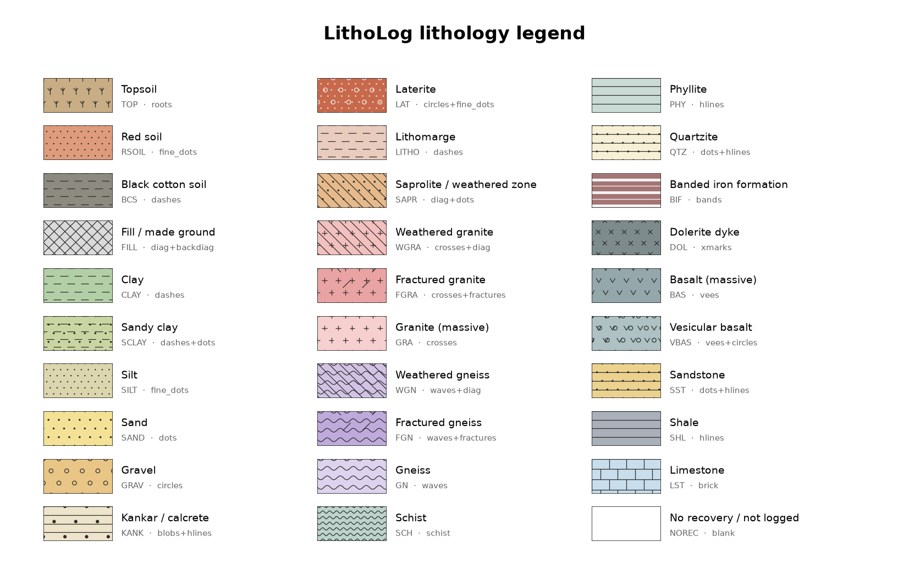

<p align="center">
  <picture>
    <source media="(prefers-color-scheme: dark)" srcset="docs/logo.svg">
    
  </picture>
</p>

# LithoLog

**Free, open-source borehole logging for geologists, hydrogeologists and geotechnical engineers.**

Fill in one Excel sheet (or point it at a GMS borehole file) → get publication-quality
borehole strip logs, cross-sections, 3D fence diagrams, contour maps and a 3D lithology block
model with volumes and groundwater-storage estimates — as PDF, PNG or SVG.



## The browser app (no command line needed)

```bash
pip install -e ".[app]"
litholog app            # opens http://localhost:8501
```

Upload your Excel workbook or GMS borehole file (plus an optional legend and a zipped study-area
shapefile), or try the demo data. Pages: **Overview** (location map, data check, legend) ·
**Strip logs** · **Cross-section** · **Fence** · **Maps** · **3D model** (smooth solids you can
rotate, standard views, volumes and storage with your specific yields) · **Help**. Every result can
be downloaded (PDF, PNG, interactive HTML, ASCII grids, CSV, VTK).

### Put the app online (free)

On [Streamlit Community Cloud](https://share.streamlit.io): sign in with GitHub → **New app** →
choose this repository, branch `main`, main file `streamlit_app.py` → **Deploy**. Anyone with the
link can then use LithoLog in their browser. (PNG export of 3D views is not available there, as it
needs Chrome; the interactive 3D view and all other downloads work.)

## Quick start (3 commands)

```bash
pip install -e .                       # from this folder (Python 3.9+)
litholog template my_site.xlsx         # 1. get the input workbook
# ... fill in my_site.xlsx in Excel / LibreOffice ...
litholog striplog my_site.xlsx         # 2. strip logs appear in ./striplogs/
```

Try it on the bundled (synthetic) demo data:

```bash
litholog striplog examples/sample_project.xlsx --title "Demo project"
```

## What goes in the workbook

| Sheet | One row per… | Columns |
|---|---|---|
| **Boreholes** | borehole | Borehole ID, Easting/X, Northing/Y, Elevation (m amsl), Total depth (m). *Any extra column you add (Location, Date, Drilling method, Logged by, Client…) is printed in the log header.* |
| **Lithology** | depth interval | Borehole ID, From (m), To (m), Code, Description |
| **Construction** *(optional)* | pipe / annulus interval | Borehole ID, From, To, Element (`casing`, `screen`, `gravel pack`, `seal`/`grout`, `open hole`), Diameter (mm), Material |
| **WaterLevels** *(optional)* | measurement | Borehole ID, Date, Depth to water (m bgl) |
| **Downhole** *(optional)* | reading | Borehole ID, Depth, Parameter, Value, Unit — e.g. resistivity, gamma, EC, drilling yield (up to 3 curves are plotted) |
| **Legend** *(optional)* | lithology code | Code, Name, Color, Pattern — add your own codes or restyle the built-in ones |

Headers are matched loosely: `BH ID`, `Well`, `Borehole` all work; units in brackets are ignored;
dates can be `2025-03-13` or `13-03-2025`. A folder of CSV files with the same names also works.

## Importing GMS borehole files

LithoLog reads GMS borehole text files (`Name  X  Y  Z  Material`, tab/space/comma separated)
directly. Each row is the top elevation of a contact and the material below it; the last row of a
hole marks its bottom. Elevations become depths below the collar, and material IDs become
lithology codes; give them names, colours and patterns in a small legend file
(see `examples/gms_legend_example.csv`):

```bash
litholog striplog boreholes_gms.txt --legend my_legend.csv      # logs straight from GMS data
litholog convert  boreholes_gms.txt my_site.xlsx --legend my_legend.csv
# → editable workbook: add descriptions, well construction, water levels, then re-run striplog
```

## Cross-sections

```bash
litholog section data.xlsx -b BH-01 BH-04 BH-07 -n "A-A'"         # line runs hole to hole
litholog section data.xlsx --line 778000,943000 808000,925000 --buffer 1000 -n "B-B'"
litholog section data.xlsx -s sections.csv                        # many sections at once
```

`sections.csv` lists `Section, Borehole ID` rows in order along each line (or `Section, X, Y`
vertices, with an optional `Buffer` column); see `examples/sections_example.csv`.
Holes near a `--line` are projected onto it and labelled with their offset.

Layers are joined between neighbouring holes by aligning the two sequences, much like correlating
by hand: the same unit at a similar level is joined, a unit found in only one hole pinches out
half-way, and different units at the same level meet at a vertical boundary half-way between the
holes. Each section has a location plan, legend, ground surface, water table (if measured) and a
vertical exaggeration chosen to fill the page (`--ve 20` to fix it; `--page A4`).
`--datum depth` hangs all holes from a flat ground surface instead of their elevations.



## Fence diagrams (3D)

```bash
litholog fence data.xlsx                              # minimum spanning tree: every hole, no crossings
litholog fence data.xlsx --network delaunay           # denser triangulated network
litholog fence data.xlsx --network sections -s sections.csv
litholog fence data.xlsx --views 4 -o fence.pdf       # four views around the model
```

`--azim` / `--elev` set the viewing direction and `--ve` the vertical exaggeration.



## Contour maps

```bash
litholog map data.xlsx -a ground top:KHON thickness:FRAC water -m kriging
```

| Attribute | Map |
|---|---|
| `ground` | ground (collar) elevation |
| `top:CODE`, `base:CODE` | elevation of the top / base of a unit |
| `depth:CODE` | depth below ground to a unit |
| `thickness:CODE` | total thickness of a unit (isopach), with its volume |
| `water`, `dtw` | water-table elevation (with flow arrows) and depth to water |

Gridding by inverse distance (`idw`, default), `linear` (TIN) or ordinary `kriging` with an
automatically fitted spherical variogram. Maps are limited to the area enclosed by the boreholes
(`--no-mask` for the full rectangle). Each map is also saved as an ESRI ASCII grid (`.asc`) that
opens in QGIS, ArcGIS or Surfer, plus a CSV of the borehole values.



## 3D geological model, volumes and groundwater storage

```bash
litholog model data.xlsx --sy 4=0.015 --only 4
```

**Horizon method (default, `--method horizons`)** — like GMS *Horizons → Solids*:

1. Every layer is traced from hole to hole by aligning the borehole sequences (multiple-sequence
   alignment on lithology and depth). A unit that occurs more than once — e.g. two or three
   water-bearing fracture zones at different depths — becomes separate horizons
   ("Fractured layer · zone 1, zone 2 …").
2. The thickness of each horizon is interpolated as a surface (`--grid-method idw|kriging|linear`),
   with zero where it pinches out between holes.
3. Horizons are stacked from the ground surface (DEM or collars) down to the base of drilling, so
   surfaces never cross and thin layers stay **continuous** instead of breaking into isolated lenses.
4. Volumes are integrated exactly from the thickness grids; per-horizon volumes, mean thickness and
   area covered go to `horizons.csv`. Solids are meshed straight from the horizon surfaces.

**Voxel method (`--method voxel`)** — each voxel takes the lithology favoured by an inverse-distance
vote of the boreholes (`--datum depth|elevation`); better for irregular bodies and lenses that do
not continue between holes. Volumes use the vote proportions so thin units are not under-counted.

`--sy CODE=value` adds groundwater storage = volume × specific yield (your estimate) per unit.

Outputs (default `--style smooth`):

* `solid_3d.html` — interactive 3D model (rotate, zoom, hide units by clicking the legend); opens
  in any browser, no installation needed.
* Standard views as PNG and on one sheet (`solid_views.pdf`): oblique from SW / NE (with a cut-away
  corner showing the interior), top (plan), front, back, left and right (orthographic).
  Choose with `--views top front oblique_se ...`; `--cutaway ne|nw|se|none`.
* `--only CODE` also draws that unit alone.
* Horizontal slices, `volumes.csv`, `horizons.csv` and `model.vtk` for ParaView. `--style blocks`
  gives the voxel (block) rendering instead; `--style both` gives both.

PNG export uses Chrome/Chromium through Kaleido; if none is found, the HTML is still written
(run `plotly_get_chrome` once to install one).



## Study-area boundary (shapefile, KML/KMZ, GeoJSON)

```bash
litholog map   data.xlsx -a thickness:4 --boundary study_area.shp
litholog model data.xlsx --sy 4=0.015 --boundary study_area.kmz
```

Boundaries can be a shapefile (`.shp` with `.prj`, or zipped), a Google Earth `.kml` / `.kmz`, or
`.geojson`. Maps and the model then cover and are clipped to the polygon (multi-part polygons and
holes are supported), volumes and storage are totalled inside it, and the outline is drawn on maps,
slices and 3D views. The share of the study area lying beyond the boreholes (extrapolated) is reported.

The boundary is reprojected into the boreholes' coordinates. Give the boreholes' system with
`--crs EPSG:32643`; otherwise KML/GeoJSON (latitude/longitude) are put into the UTM zone that
matches the boreholes, and a UTM shapefile in the wrong zone is moved to the neighbouring zone that
overlaps them (both reported).

## Digital elevation model (DEM)

```bash
litholog model data.xlsx --dem srtm.tif --boundary study_area.kmz [--rectify]
```

A GeoTIFF (SRTM, ALOS, CartoDEM, … in any coordinate system, including latitude/longitude) or an
ESRI ASCII grid becomes the ground surface of the model, so the top of every layer follows the real
terrain between boreholes. The collar elevations are compared with the DEM and the differences
reported; `--rectify` replaces them by the DEM values. In LithoLog Studio the terrain around the
model can also be shown in 3D (View ▸ Terrain).

## LithoLog Studio (Windows desktop app)

A ribbon interface with project tree, properties and message panels; everything runs locally.

* **3D model** with lit solids, borehole tubes, labels, study-area outline, cut-away corners and an
  interactive cutting plane; standard views (oblique, top, front, back, left, right).
* **Legend bar** under the 3D view: colour, name and volume of each layer. Click a layer to edit it,
  right-click to hide / show / isolate it, double-click the title to rename the legend. Saved images
  include the legend.
* **Layer properties**: colour picker, name, 2D pattern (with preview), group, 3D opacity and
  visibility; save / load the legend as CSV. Changes update the 3D view, logs, sections and maps.
* **Volumes** by layer and by horizon, with specific yield → storage.
* **View** tab: dark or light theme (remembered), 3D background (theme, white, sky, black), legend
  bar, axes grid, DEM terrain.
* Projects (`.llproj`) keep data, legend, boundary, DEM and all settings.

## Model validation (cross-validation)

```bash
litholog crossval data.xlsx --unit 4 --boundary study_area.kmz -o validation
```

Every borehole is hidden in turn and its log predicted from the others (leave-one-out
cross-validation). The report (`validation.pdf`, CSV tables) gives, for each method — horizons with
IDW or kriging, voxel, and the nearest-borehole baseline that any model must beat:

* the share of drilled depth predicted correctly, on average and at the worst 10 % of holes;
* for each unit: occurrences found at the hidden borehole, false alarms, error in the depth of the
  top and in the total thickness;
* a map of accuracy at every borehole, and a map of distance to the nearest borehole (data support);
* the volume of each unit from every method, as a practical uncertainty range.

In LithoLog Studio: Analysis ▸ Cross-validation.

## Groundwater, properties, layers, chemistry and fractures

```bash
litholog aquifer  data.xlsx --wells wells.xlsx --sy FRAC=0.015 --boundary area.shp
litholog property data.xlsx -p Resistivity --below 100
litholog strat    data.xlsx --order TOP ALLUV CLAY SAND BASEMENT
litholog chem     water_quality.xlsx -o chemistry
litholog fractures data.xlsx
litholog section  data.xlsx -b BH1 BH2 BH3 --style logs --curve Resistivity
```

* **Aquifer** — observation wells in any common layout (one row per reading, or one column per
  season as in CGWB / India-WRIS tables; X/Y or latitude/longitude, converted automatically) →
  water-table and depth-to-water maps, *saturated* volume and storage of each unit, saturated
  thickness maps, and the storage change between seasons.
* **Property models** — downhole readings (resistivity, EC, yield, …) interpolated in 3D
  (anisotropic inverse distance, log scale for resistivity-like data): slices, an interactive
  3D volume, VTK, and the volume within a value range.
* **Stratigraphic models** — ordered formation tops → non-crossing surfaces → solids and volumes.
* **Hydrochemistry** — ionic balance, water type, SAR, %Na, RSC, Kelly's ratio, PI, MH; Piper,
  Durov, Stiff, USSL (Richards 1954), Wilcox (1955) classes and Gibbs diagrams.
* **Fractures** — a Fractures sheet (depth, dip, dip direction, aperture, water-strike yield):
  strike rose, equal-area stereonet with pole density, frequency with depth, and a tadpole track on
  strip logs.
* **Log sections** — strip logs placed along a section line with a downhole curve beside each.

All of these are also in LithoLog Studio (ribbon ▸ Analysis).

## Commands

```
litholog template FILE.xlsx [--empty]        write the input workbook (with example rows)
litholog validate DATA                       check for overlaps, gaps, bad depths, unknown codes
litholog striplog DATA [-o DIR] [-f pdf|png|svg] [-b BH1 BH2] [-m 50] [--title NAME]
litholog section DATA (-b IDS | --line X,Y ... | -s FILE) [--ve N] [--page A3|A4]
litholog fence DATA [--network mst|delaunay|sections] [--views N] [-o fence.pdf]
litholog map DATA -a ATTR ... [-m idw|linear|kriging] [--cell M] [--boundary SHP|KML|KMZ|GEOJSON [--crs EPSG]]
litholog model DATA [--method horizons|voxel] [--grid-method idw|kriging|linear] [--dem DEM.tif [--rectify]]
                    [--datum depth|elevation] [--sy CODE=SY ...] [--only CODE ...] [--boundary FILE]
litholog convert DATA [OUT.xlsx] [-l LEGEND] turn GMS text / CSV folder into a workbook
litholog legend [DATA] [-o legend.pdf]       list / draw the lithology legend

Add `-l my_legend.csv` to validate / striplog / convert to use your own codes.
```

`-m 50` splits long holes into pages of 50 m each; by default each hole fits on one A4 page.
A combined `all_boreholes.pdf` is written alongside the individual logs.

## Lithology legend

30 built-in codes covering soils, alluvium, the laterite–saprolite weathering profile,
crystalline, volcanic and sedimentary rocks. All patterns are original to LithoLog and
drawn at a fixed printed size, so they look the same at any depth scale. Combine patterns
with `+` (e.g. `crosses+fractures`).



## Use from Python

```python
from litholog import load_project, save_striplog, validate

project = load_project("my_site.xlsx")
for issue in validate(project):
    print(issue)
bh = project.borehole("BW-01")
save_striplog(bh, project.legend, "BW-01.pdf")
```

## Roadmap

- [x] **M1** Borehole database (Excel/CSV/GMS), validation, strip logs, custom legends
- [x] **M2** Cross-sections (hole-to-hole or along any line), 3D fence diagrams
- [x] **M3** Contour maps (surfaces, isopachs, water table), 3D block model, volumes, storage
- [x] **M4** Browser app, smooth 3D solids with standard views, interactive 3D viewer
- [x] **M5** Desktop app (LithoLog Studio) with Windows installer; aquifer/storage, property models,
      stratigraphy, hydrochemistry, fractures, log sections
- [x] **M6** Horizon-based modelling (continuous thin layers), DEM ground surface and terrain,
      KML/KMZ/GeoJSON boundaries, layer properties, editable legend bar, dark/light themes, logo
- [x] **M7** Inter typeface, sharper 3D text, per-horizon visibility, textures, print export with
      chosen DPI and text size, leave-one-out cross-validation report
- [ ] Next: KMZ/DXF export, faults, database connection

## Development

```bash
pip install -e ".[dev]"
pytest
python examples/make_sample.py   # regenerate the demo workbook
```

The demo data in `examples/` is **synthetic** and for illustration only.

## License

MIT, see [LICENSE](LICENSE). Contributions welcome.
